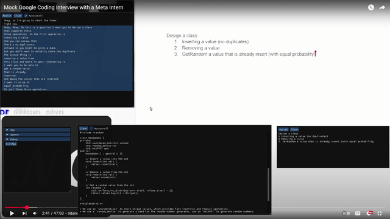

# AUG

Stealth offline AI interview assistant

## Features

- Record/process interviewer speech in real time
- Offline/online assistant backend via OpenAI completion API
- Image recognition
- Invisible on screen capture

## Build

Only windows supported

Compile deps with `build_deps.cmd`

Compile app with `build_AUG.cmd`

## Deploy

Copy AUG.exe to `<AUG_dir>`

Copy `<AUG_repo>/data/fonts.ini` to `<AUG_dir>`

Download to `<AUG_dir>/models`

[ggml-small.bin](https://huggingface.co/ggerganov/whisper.cpp/resolve/main/ggml-small.bin)

Download to `<AUG_dir>/tessdata`

[eng.traineddata](https://github.com/tesseract-ocr/tessdata/blob/main/eng.traineddata)

[osd.traineddata](https://github.com/tesseract-ocr/tessdata/blob/main/osd.traineddata)

## Run

Start AUG.exe

Press `Shift ~` to display overlay

Press mouse wheel to mark text
